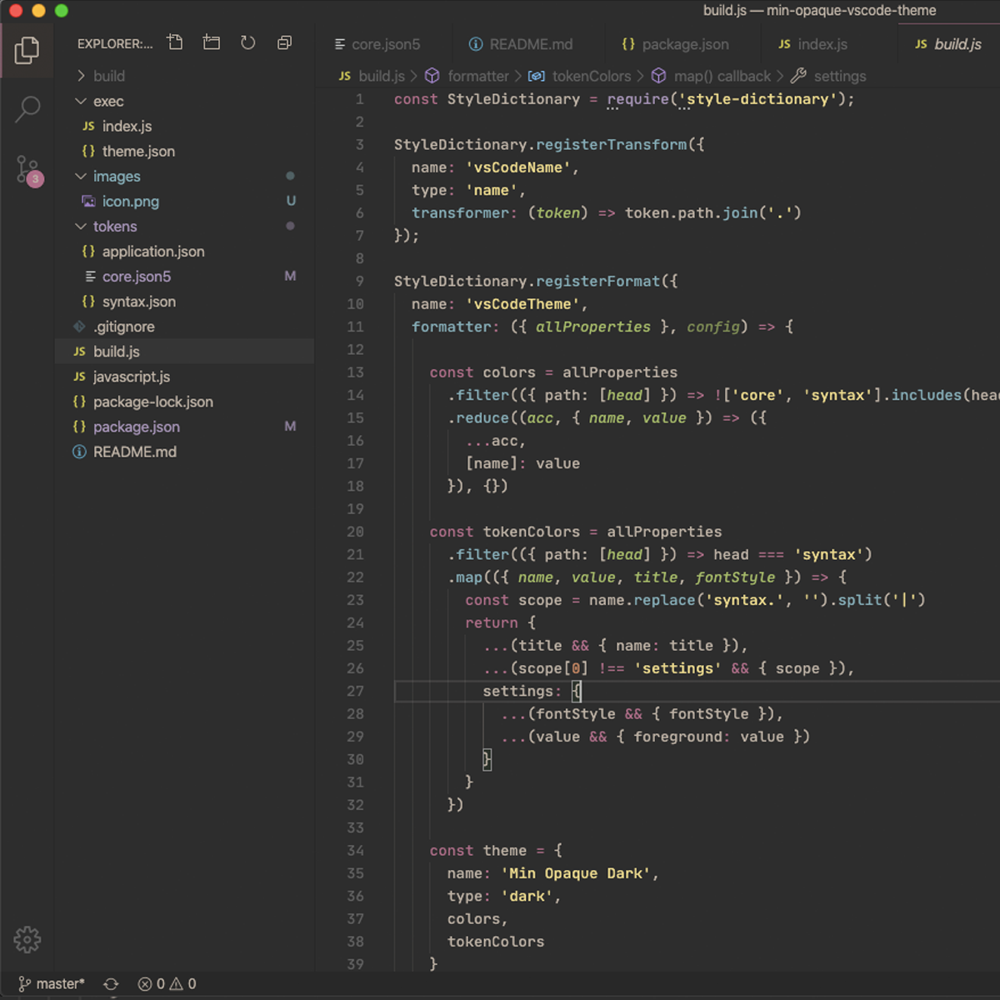

# Min Opaque

> A VSCode theme that is minimally opaque.

## References

Thanks [Danny Banks `dbanksdesign`](https://github.com/dbanksdesign) for your great guide => [Nu Disco Theme](https://dbanks.design/blog/vs-code-theme-with-style-dictionary/)